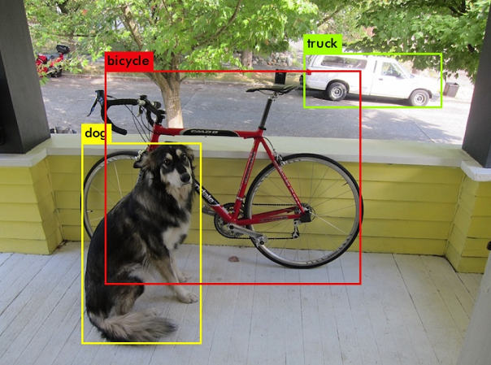
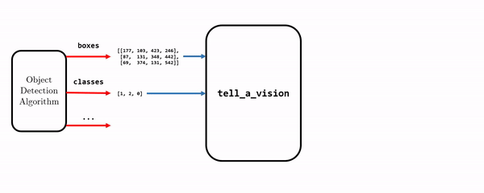
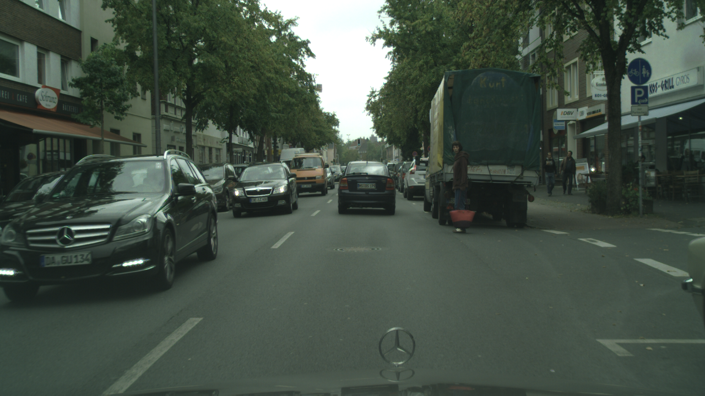
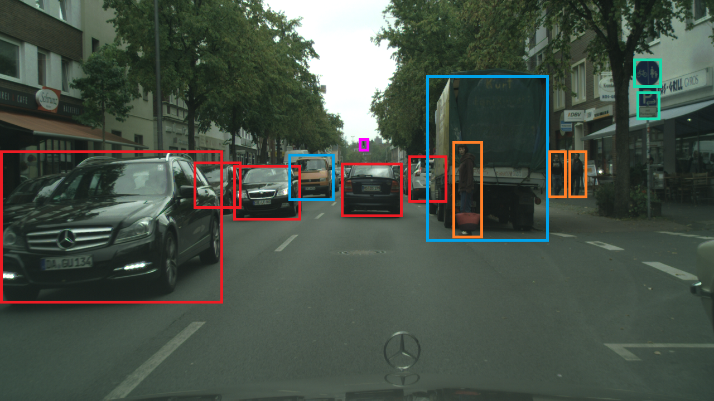
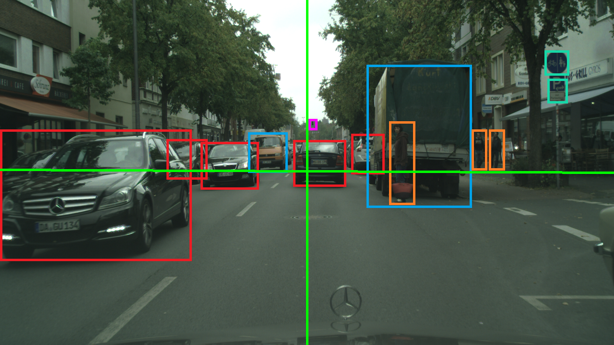

# tell a vision 📺

<p align="center">
  
</p>

**tell a vision (`tv`)**  is a Python package that describes the scenes for object detection tasks in computer vision.

## Introduction
The task of object detection consists of three subtasks: object recognition, localization, and classification. Usually, object detection projects present their output in a visual format that shows the objects found with bounding boxes in different colors representing their classes. Something like this:

<p align="center">
  
</p>

But what if we could make the computer tell us what it is seeing? For example: "There is a dog in the bottom left, a bicycle in the middle, and a truck on the top right." What if the computer can *tell a vision*? Pretty cool right?

**tell a vision (`tv`)** is Python package that can provide explanatory analysis on the output of object detection algoirthms. It takes bounding boxes, and the classes of the objects found and answers questions such as:

- How many objects and of what kind are in a specific region of the scene?
- How far are they? Are they close? 
- Are they small or medium-sized?
- ...

And in the end, using TTS (Text To Speech) it can describe the scene.

Here is a mere representaion of what **`tv`** does:

<p align="center">
  
</p>

## Documentation
Try **`tv`** using [this]() demo notebook on your local machine or via colab [here]().
### Requirements
1. Python interpreter version 3.7 or later
2. Package prerequisites:
    - numpy version 1.21 or later
    - gTTs (Google Text to Speech) version 2.2.4 or later

Note: *Package prerequisites will be checked and installed if you'll follow the installation step, otherwise if you're using the source directly, you'll need to check and install them yourself.*
### Installation
You can install **`tv`** via `pip` or by downloading the source and installing it manually.
#### Method one:
**`tv`** is available on PyPI and installable with `pip`:
```
pip install --upgrade tell-a-vision
```

#### Method two:
1- Download this repository as zip and extract it or use:
```
git clone https://github.com/rezmansouri/tell_a_vision.git
```
2- Change directory to the package's root:
```
cd tell_a_vision
```
3- Make sure you have setuptools package installed:
```
pip install --upgrade setuptools
```
4- Install the package via the `setup.py ` script:
```
python setup.py install
```

### Basic usage
**`tv`** can do more than what you need, but its complete goal is as follows: First, to tell the placement of the objects your algorithm had found (i.e. right, left, middle, above, bottom, midst). `tv.locate()` does this task of describing the localization. Further, `tv.Ruler` does the task of describing the size / distance of the objects found (i.e. close, near, far, or small, medium, big). The last but not least feature of this package, is `tv.Narrator` where it can take the output of the two former features and describe the scene fully via text or audio.

Normally your object detection algorithm will output these results:

1. **`boxes`**: an array (tensor) of shape `(n, 4)` where `n` is the number of boxes found and the last axis contains `[ymin, xmin, ymax, xmax]` of the found object's bounding box coordinates.

2. **`classes`**: an array (tensor) of shape `(n,)` where `n` is the number of boxes found and it contains the integer index of the found objects' class labels.

3. Other outputs: confidence score, class confidence score, and other outputs that **`tv`** won't have anything to do with.

**Note**: **`tv`** works on the final output of your object detection algorithm. It neither does *non-max suppression* nor rescaling the outputs. So make sure the inputs your providing are the ones that you consider as the final results.

For the rest of this documentation, let's consider the following output of an object detection algorithm, such as YOLO, as an example:

<p align="center">
  
</p>

The corresponding `boxes` and `classes` for this visualization, provided by the object detection algorithm, are:
```python
boxes = [[275,    4,  546,  400],
         [290,  350,  371,  431]
         [294,  425,  395,  540],
         [268,  521,  357,  597],
         [288,  610,  390,  717],
         [250,  638,  272,  660]
         [285,  733,  356,  787],
         [145,  775,  427,  987],
         [252,  810,  422,  867],
         [266,  971,  370, 1013],
         [270, 1018,  355, 1056],
         [104, 1133,  155, 1186],
         [163, 1141,  211, 1184]]

classes = [1, 1, 1, 2, 3, 1, 1, 2, 0, 0, 0, 4, 4]
```
This scene (picture) is 1280px wide and 720px high. The objects are mentioned from left to right (if you're following the coordinates) and the class labels are:
```python
CLASS_LABELS = ['pedastrian', 'car', 'truck', 'traffic light', 'traffic sign']
```

<p align="center">
  
</p>

#### Task one: Localization with `tv.locate()`
First, let's see if the objects we've found are placed left, middle, right (or optionally, above, midst, bottom) of the scene.
```python
import tell_a_vision as tv

locations = tv.locate(boxes=boxes, scene_width=1280, scene_height=720, horizontal_only=False)
```
`tv.locate` returns an array of shape `(n, 2)` where the last axis's first element represent horizontal location (0: left, 1: middle, 2: right), and the second element represents the vertical location (0: above, 1: midst, 2: bottom) of the nth object. 


The `locations` result for our example would be:
```python
[[0, 2],
 [0, 0],
 [0, 0],
 [0, 0],
 [1, 0],
 [2, 0],
 [2, 0],
 [2, 1],
 [2, 0],
 [2, 0]]
```

#### Task two: Distance estimation with `tv.Ruler`
`tv.Ruler` needs to be fit on a dataset, preferably big enough, to obtain quartiles of each object class's areas. By doing so it will be able to place a new object into these quartiles according to its pixel area, as a measure of its size/distance in the scene.

Suppose we have a dataset of 1000 images with their corresponding bounding box annotations in a list call `images`. The list would look something like this:
```python
images = [
    [
        {
            'box': {
                    'x1': 400.12,
                    'y1': 700.50,
                    'x2': 1156.97,
                    'y2': 900.20
                   },
            'class': 'car'
        },
        {
            'box': {
                    'x1': 867.12,
                    'y1': 716.50,
                    'x2': 1250.9764,
                    'y2': 987.42
                   },
            'class': 'truck'
        },
        {
            'box': {
                    'x1': 90.107,
                    'y1': 467.11,
                    'x2': 100.86,
                    'y2': 500.42
                   },
            'class': 'pedastrian'
        },
    ],
    [
        {
            'box': {
                    'x1': 665.44,
                    'y1': 133.18,
                    'x2': 688.556,
                    'y2': 210.87
                   },
            'class': 'truck'
        },
        {
            'box': {
                    'x1': 967.12,
                    'y1': 716.50,
                    'x2': 1254.964,
                    'y2': 987.42
                   },
            'class': 'car'
        },
        {
            'box': {
                    'x1': 80.107,
                    'y1': 367.11,
                    'x2': 90.83,
                    'y2': 450.4
                   },
            'class': 'traffic light'
        },
        {
            'box': {
                    'x1': 90.7,
                    'y1': 467.11,
                    'x2': 95.86,
                    'y2': 510.98
                   },
            'class': 'traffic sign'
        },
    ],
    ...
]
 
```
Each element in `images` represents the annotation of an image in your dataset and contains bounding box coordinates along with classes of the objects in the image.

```python
ruler = tv.Ruler(images=images, classes=CLASS_LABELS) # Fitting the ruler on your annotations
```

After, although a private variable and inaccessible, ruler's quartiles would be something like this:
```python
{
    'truck':         [200.12,  405.85,  793.11],
    'car':           [536.11,  863.94,  1076.2],
    'pedastrian':    [12.133,  60.353,  100.34],
    'traffic light': [5.65,    18.46,    52.11],
    'traffic sign':  [4.42,    15.96,    89.91]
}
```
Now with `ruler.get_ranks()` we are able to find the quartile intervals of the objects we've found:
```python
ranks = ruler.get_ranks(boxes=boxes, classes=classes)
```
Each element of `ranks` corresponds to the found object's specific class quartile interval (0, 1, 2, or 3). `ranks` would be of shape `(n,)` and look something like this:
```python
[3, 2, 2, 2, 2, 0, 1, 3, 3, 1, 1, 3, 3]
```
`0` can be inferred as small / far, `1` as relatively small / far, `2` as roughly big / near, `3` as big / near.

*As can be seen, moving from left to right, the cars are close, near, near, the truck is near, the car in the middle is near, the traffic light is far, the car parked on the right is near, the truck on the right and the pedastrian beside it are close, the two pedastrians on the right are near, and the two traffic signs are near.*

#### Task three: Scene narration with `tv.Narrator`
Now our goal is to group together our findings to get a concise description of the scene, and maybe let **`tv`** *finally tell the vision!*
```python
narrator = tv.Narrator(classes_labels=CLASS_LABELS, audio_directory='./audio', horizontal_only=False)
```
This will create a narrator object and download all possible narrations for your classes as `.mp3` files in `./audio`. The directory will look something like this:
- 1-car-left-bottom-near.mp3
- 2-car-left-midst-near.mp3
- ...
- 4-traffic light-middle-above-far.mp3
- ...
- 5-pedastrian-middle-above-close.mp3

Finally, using `narrator.get_narration()` static method we can get the summerized description of the scene in the format of the name of the audio files to be played:
```python
narration = narrator.get_narration(classes=classes, class_labels=CLASS_LABELS, ranks=ranks, locations=locations)
```
`narration` for our example would be something like this:
```python
[
    '1-car-left-bottom-close',
    '2-car-left-above-near',
    '1-truck-left-above-near',
    '1-car-middle-above-near',
    '1-traffic light-right-above-far',
    '1-car-right-above-near',
    '1-truck-right-above-close',
    '1-pedastrian-right-above-close',
    '2-pedastrian-right-above-near',
    '2-traffic sign-right-above-near'
 ]
```
If since the beginning of this procedure, `horizontal_only` was set to `True` (default value) everywhere, the resulting `narration` would've been like this:
```python
[
    '1-car-left-close',
    '2-car-left-near',
    '1-truck-left-near',
    '1-car-middle-near',
    '1-traffic light-right-far',
    '1-car-right-near',
    '1-truck-right-close',
    '1-pedastrian-right-close',
    '2-pedastrian-right-near',
    '2-traffic sign-right-near'
 ]
```
Specific for you own application, you may choose to play these audio files from `./audio` consecutively, low-speed, high-speed, merge them together, etc.. Not **`tv`**'s business! But lets hear a demo:
```python
import IPython
for nar in narration:
  IPython.display.display(IPython.display.Audio(f'audio/{nar}.mp3'))
```
https://user-images.githubusercontent.com/46050829/189135844-c3fc75ba-02f3-41e5-9feb-1fa15130d400.mp4

Lets take a look at the picture again:

<p align="center">
  
</p>

### Reference
#### `locate(boxes, scene_width, scene_height, v_point=.66, h_point=.66, horizontal_only=True)`
#### Parameters
- `boxes`: numpy array of shape (n, 4) where n is the number of the boxes found and each element contains bounding box of the found object in the following format: `[ymin, xmin, ymax, xmax]`.
- `scene_width`: integer representing the width of the scene in pixels.
- `scene_height`: integer representing the height of the scene in pixels.
- `v_point`<sup>1</sup>: portion of an objects height to be considered as a threshold when it is placed vertically near-midst to determine its vertical placement. Defaults to `0.66`.
- `h_point`<sup>1</sup>: portion of an objects width to be considered as a threshold when it is placed horizontally near-middle to determine its horizontal placement. Defaults to `0.66`.
- `horizontal_only`: Whether to locate the objects only horizontally. Defaults to `True`.

1- `v_point` and `h_point` are described more in detail here:
